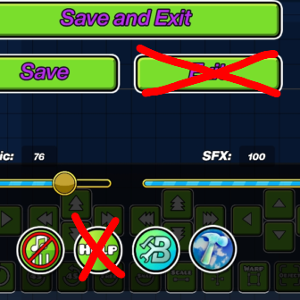

# NoMoreHelpButton
Are you a mobile creator and everytime you want to copy and paste then you clicked the pause button because it was too damn close to the copy and paste button and you accidentally clicked the help button when you were trying to move that object and you get sent to Chrome and all the progress is lost because you have a "doodoo garbage" phone that can't even multitask?
Or when you accidentally clicked the exit button and lost all your progress?
Well this mod is for you!
# Functionality
Banishes that annoying help button and the exit button to the The Shadow Realm.
You could turn off this mod in the mod's settings when you have a better phone. Or if you have a game app to disable any redirects then this mod is useless. (Unless if you forgot to turn it on, this mod is a backup)

yep that's it bye!!! 

